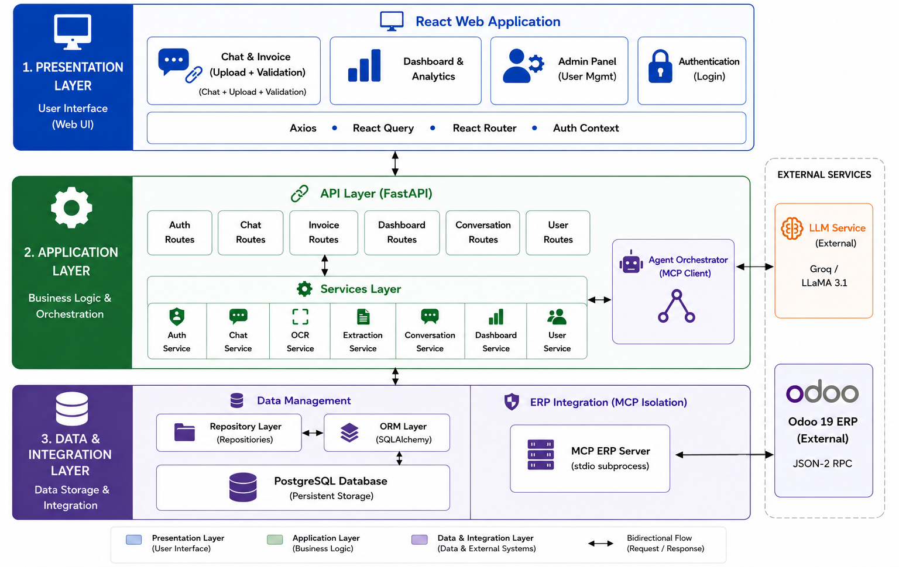
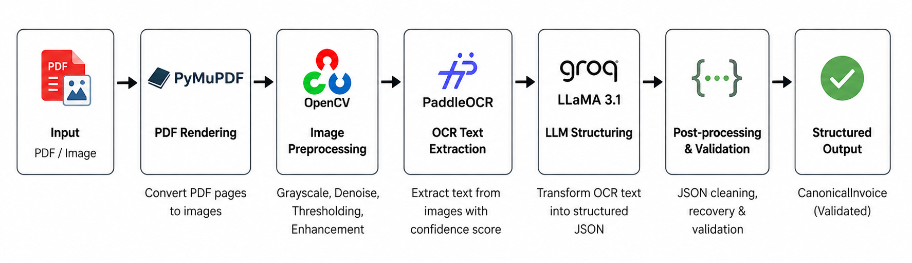
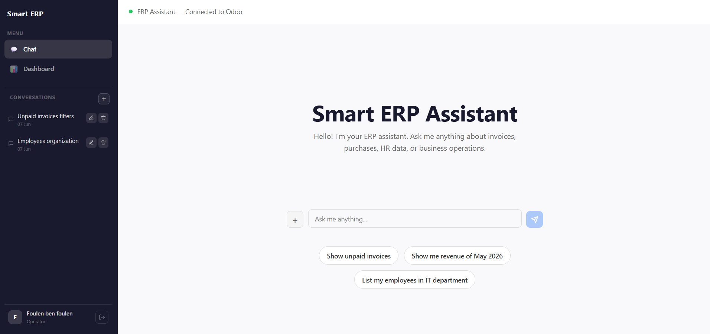
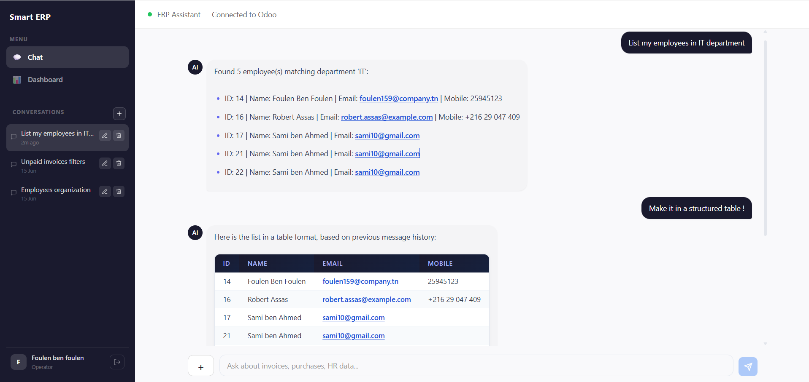
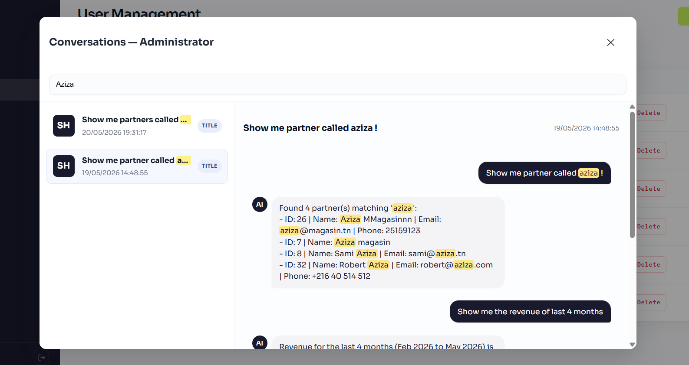

# 🧠 Smart ERP — AI-Powered Business Management Platform

> An intelligent ERP assistant that lets you interact with your enterprise system using natural language, automate invoice processing, and monitor business activity in real time.

> Developed during an internship at **[Vneuron](https://www.vneuron.com)** — a leading Tunisian RegTech company. Shared publicly for demonstration and portfolio purposes.

---

## 📌 Table of Contents

- [Overview](#overview)
- [Features](#features)
- [Key Technical Highlights](#key-technical-highlights)
- [Architecture](#architecture)
- [AI Agent Workflow](#ai-agent-workflow)
- [Screenshots](#screenshots)
- [Tech Stack](#tech-stack)
- [Project Structure](#project-structure)
- [Getting Started](#getting-started)
- [MCP Tool Registry](#mcp-tool-registry)
- [API Overview](#api-overview)
- [Roadmap](#roadmap)
- [Author](#author)

---

## Overview

Traditional ERP systems like Odoo are powerful but notoriously hard to use — complex menus, manual data entry, and steep learning curves block non-technical users from getting value out of them.

**Smart ERP** augments Odoo with an AI-powered conversational layer that enables users to query data, execute business operations, and automate document processing using natural language.

Users can:

- Upload an invoice (PDF or image) and have its data extracted automatically
- Review and validate extracted invoice data through a human-in-the-loop workflow before committing it to the ERP
- Ask questions and trigger ERP operations using natural language
- Manage users and audit conversations from an admin panel

The platform uses the **Model Context Protocol (MCP)** to connect the AI agent to Odoo securely — keeping all sensitive data within the company's infrastructure.

---

## Features

### 🤖 Conversational AI Assistant
- Natural language interface to query and operate the ERP
- Persistent conversation history with secure public identifiers
- Create, rename, and delete conversations

### 📄 Intelligent Invoice Processing
- Upload PDF or image invoices directly in the chat
- Automatic OCR extraction via **PaddleOCR** + image preprocessing (OpenCV)
- LLM-powered structuring of raw OCR text into clean JSON (Groq / LLaMA 3.1)
- **Human-in-the-loop** validation form — review and correct before committing to ERP

### 🔌 ERP Integration via MCP
- Isolated MCP server running as a subprocess (stdio transport)
- 9 registered tools covering invoices, partners, employees, and revenue
- Adapter pattern for future ERP vendor swappability

### 📊 Dashboard & Analytics
- KPIs, monthly revenue trends, recent unpaid invoices
- Role-separated views for Operators and Admins

### 🔐 Authentication & RBAC
- JWT-based authentication with bcrypt password hashing
- Role-Based Access Control (`Admin` / `Operator`) enforced on every endpoint
- Full user management (CRUD, activate/deactivate) with conversation history preservation

### 🛠️ Admin Panel
- Advanced keyword search across all users' conversations with term highlighting
- View full conversation history of any user

---

## Key Technical Highlights

- MCP-based ERP integration with Odoo
- Human-in-the-loop invoice validation workflow
- OCR pipeline using PaddleOCR and OpenCV
- AI-powered tool selection and orchestration
- Role-based access control with JWT authentication
- Conversation persistence and admin audit capabilities

---

## Architecture

Smart ERP follows a clean **three-tier architecture**:

```
┌─────────────────────────────────────────────────────────┐
│                   Presentation Layer                     │
│          React 18 + Vite  (SPA)                         │
│   Chat UI  │  Human-in-the-loop  │  Dashboard  │  Admin  │
└───────────────────────┬─────────────────────────────────┘
                        │ HTTP / REST
┌───────────────────────▼─────────────────────────────────┐
│                  Application Layer                       │
│              FastAPI  (Python)                          │
│   Auth  │  Conversations  │  Invoice  │  Dashboard      │
│         routes → services → repositories                │
└──────────────┬───────────────────────┬──────────────────┘
               │ SQLAlchemy            │ stdio (MCP)
    ┌──────────▼──────┐     ┌──────────▼──────────────┐
    │   PostgreSQL     │     │     MCP ERP Server       │
    │  (local DB)      │     │  FastMCP + Odoo Adapter  │
    └──────────────────┘     └──────────┬───────────────┘
                                        │ JSON-RPC 2.0
                                   ┌────▼──────┐
                                   │  Odoo 19  │
                                   └───────────┘
```

The MCP server runs as a **subprocess** of the FastAPI backend, ensuring Odoo credentials and ERP data never leave the company's infrastructure — even when a cloud-hosted LLM (Groq) is used for inference.

---

## AI Agent Workflow

1. The user submits a request through the chat interface.
2. The LLM analyzes the intent and determines whether an ERP operation is required.
3. If a matching MCP tool exists, the AI agent invokes the tool through the MCP server.
4. The MCP server communicates securely with Odoo via JSON-RPC.
5. Tool results are returned directly to the user.
6. If no ERP action is needed, the LLM responds conversationally.

This hybrid approach minimizes unnecessary LLM generations, reduces inference costs, and ensures deterministic execution of business operations.
---

## Screenshots

### High-Level Architecture



### Invoice Processing Pipeline



### Chat Landing Page



### Conversational ERP Assistant



### Admin Conversation Monitoring



---

## Tech Stack

| Layer | Technology | Purpose |
|---|---|---|
| Frontend | React 19 + Vite | Single Page Application |
| Backend | FastAPI (Python) | REST API, business logic |
| Database | PostgreSQL + SQLAlchemy 2.0 + Alembic | Persistence & migrations |
| OCR | PaddleOCR + OpenCV | Invoice text extraction |
| LLM | Groq (LLaMA 3.1) | Natural language understanding, invoice extraction, conversational assistant  |
| ERP Integration | FastMCP (Model Context Protocol) | Secure Odoo bridge |
| ERP | Odoo 19 | Business data store |
| Auth | JWT + bcrypt | Authentication & authorization |

---

## Project Structure

```
smart-erp/
├── backend/                  # FastAPI application + migrations
│   ├── alembic/              # DB migrations (env.py, versions/)
│   ├── app/
│   │   ├── api/              # Request routers & websocket
│   │   │   ├── routes/       # auth_routes.py, chat_routes.py, conversation_routes.py, dashboard_routes.py, invoice_routes.py, user_routes.py
│   │   │   └── websocket/    # dashboard_ws.py
│   │   ├── core/             # Auth, config, dependency providers
│   │   ├── database/         # DB session & base
│   │   ├── llm/              # LLM provider/factory
│   │   ├── mcp_client/       # MCP client/agent integration
│   │   ├── middleware/       # Auth & dependency middleware
│   │   ├── models/           # SQLAlchemy models (user, invoice, conversation)
│   │   ├── repositories/     # DB access (user_repository, invoice_repository, ...)
│   │   ├── schemas/          # Pydantic schemas
│   │   ├── services/         # Business logic & domain services
│   │   └── utils/            # Utilities (token helpers, etc.)
│   ├── requirements.txt
+│   └── scripts/              # Backend helper scripts
│
├── frontend/                 # React + Vite SPA
│   ├── index.html
│   ├── package.json
│   ├── src/
│   │   ├── api/              # Axios client & API wrappers
│   │   ├── components/       # UI components (chat, dashboard, admin)
│   │   ├── pages/            # App pages (Chat, Dashboard, Login, Admin)
│   │   ├── contexts/         # React contexts (AuthContext)
│   │   ├── hooks/            # Custom hooks
│   │   └── services/         # Frontend service wrappers
│
└── mcp-erp-server/           # MCP server (Odoo integration)
    ├── main.py               # FastMCP server entrypoint
    ├── tools/                # Registered MCP tools (create_invoice, get_invoice, ...)
    ├── adapters/             # Odoo adapter (JSON-RPC client)
    ├── clients/              # Odoo client implementations
    └── schemas/              # Tool input/output schemas
```

---

## Getting Started

### Prerequisites

- Python 3.11+
- Node.js 18+
- PostgreSQL
- A running Odoo 19 instance
- A [Groq](https://groq.com) API key

### 1. Clone the repository

```bash
git clone https://github.com/MouhibAssas/smart-erp.git
cd smart-erp
```

### 2. Backend setup

```bash
cd backend
python -m venv venv
source venv/bin/activate  # Windows: venv\Scripts\activate
pip install -r requirements.txt

# Configure environment variables
cp .env.example .env
# Fill in: DATABASE_URL, GROQ_API_KEY, ODOO_URL, ODOO_DB, ODOO_USER, ODOO_PASSWORD, SECRET_KEY

# Run migrations
alembic upgrade head

# Start the API server
uvicorn app.main:app --reload
```

### 3. MCP ERP server setup

```bash
cd mcp-erp-server
pip install -r requirements.txt
# The FastAPI backend launches this as a subprocess automatically
```

### 4. Frontend setup

```bash
cd frontend
npm install
npm run dev
```

The app will be available at `http://localhost:5173`.

---

## MCP Tool Registry

The MCP server exposes 9 tools to the AI agent, covering all core ERP operations:

| Tool | Description | Odoo Model |
|---|---|---|
| `create_invoice` | Create a customer invoice or vendor bill | `account.move` |
| `get_invoice` | Retrieve invoice by ID or search criteria | `account.move` |
| `get_unpaid_invoices` | List unpaid invoices for monitoring | `account.move` |
| `search_invoices_advanced` | Filtered search with overdue detection | `account.move` |
| `get_revenue` | Compute revenue metrics and monthly trends | `account.move` |
| `create_partner` | Create a new customer or supplier | `res.partner` |
| `get_partner` | Search partners by name or ID | `res.partner` |
| `create_employee` | Create a new HR employee record | `hr.employee` |
| `get_employee` | Retrieve employee info and search results | `hr.employee` |

---

## API Overview

The FastAPI backend exposes a RESTful API. A full OpenAPI spec is available at `/docs` when running locally.

| Endpoint | Method | Role | Description |
|---|---|---|---|
| `/auth/login` | POST | All | Authenticate and receive JWT |
| `/chat/upload` | POST | All | Upload invoice document |
| `/chat/persistent` | POST | All | Send a chat message |
| `/conversations` | GET | All | List own conversations |
| `/invoice/confirm` | POST | All | Confirm extracted invoice to ERP |
| `/dashboard/kpis` | GET | All | Get KPI data |
| `/users` | GET/POST | Admin | Manage users |
| `/users/{id}/toggle-active` | PATCH | Admin | Activate/deactivate user |
| `/users/{user_id}/conversations/search` | GET | Admin | Search across user conversations |

---

## Roadmap

- [ ] Support for additional ERP systems (SAP, Microsoft Dynamics)
- [ ] Fully local LLM support (replace cloud Groq with on-premise model)
- [ ] Multi-language interface
- [ ] Advanced audit logging
- [ ] Workflow automation via n8n integration
- [ ] Improved document understanding accuracy

---

## Author

**Mohamed Mouhib Assas**  
Internship at **Vneuron** 

---

*Keywords: Smart ERP · MCP · LLM · OCR · FastAPI · React · Odoo · AI Automation · RegTech · Natural Language Processing*
